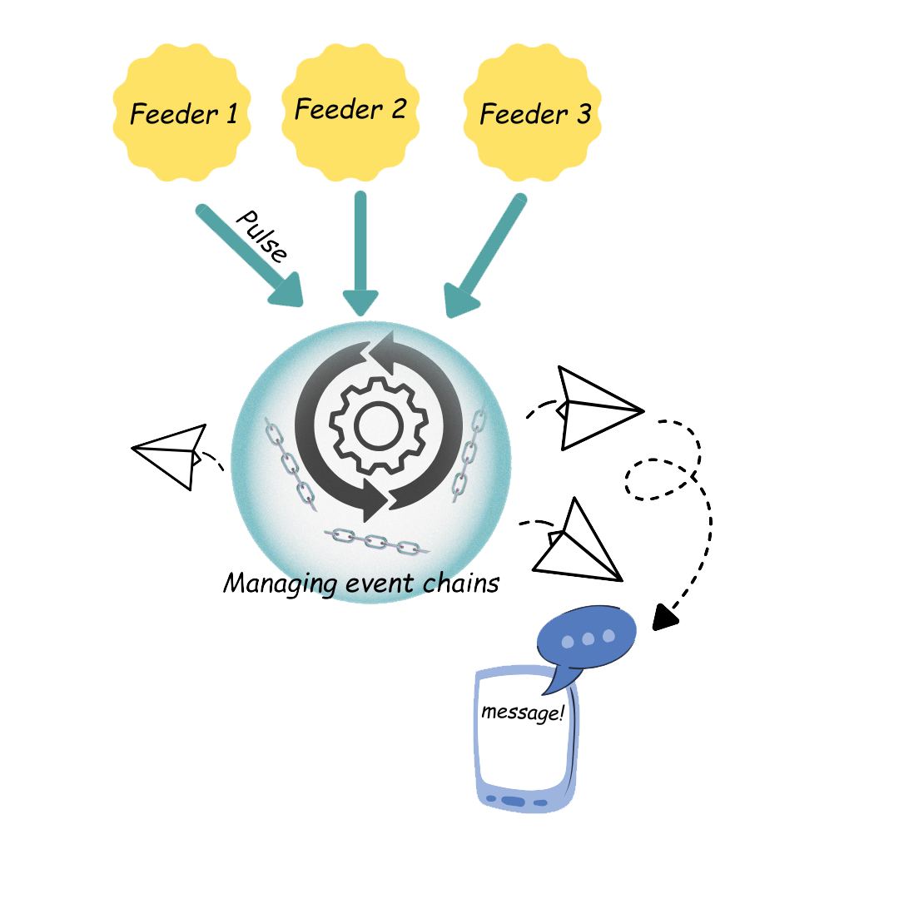

# Leech Chain Manager
### Event-Chain Manager and Messaging

---

## 📌 Overview
**Leech Chain Manager** automates event chains by processing signals from various indicators, checking their order, and sending summarized alerts to Telegram channels.  
This helps users make **informed stock market decisions** through real-time monitoring, detection of complex conditions, and rule-based triggers — all without manual effort.



---
## 📝 Features
- Build **custom event chains** using flexible elements.
- Link elements together and feed data into the system.
- Real-time evaluation of incoming signals.
- Automated alerts to Telegram channels and groups.
- Rule-based triggers for workflow automation.
- Designed for **stock market signal monitoring**, but adaptable for general workflows.

---

## 🛠️ Technologies Used
### Backend
- Java 17
- Spring Boot
- Hibernate
- Lombok
- JWT
- PostgreSQL

### Frontend
- Vue.js
- Vuetify

---

## 📡 Gateway (API Feed)
**Endpoint:**
POST {ip:port}/api/message/feed
(default port is 8080)

**Payload Example:**
```json
{
  "sentDate": 1691234567890,    // GMT milliseconds
  "symbol": "AAPL",             // String(16), case-sensitive
  "code": "BUY12345",           // String(8), case-sensitive
  "sender": "signal-bot",       // String(16)
  "info": "RSI crossover"       // String(32)
}
```
✅ No authentication required.

---

## 👤 Default User

- Username: user

- Password: user

## 🚀 Next Steps

Implement persistence of:

- Persist messages in DB (via MyBatis).

- Elements, chains, and rules (per user).

- Extend Telegram integration with more flexible tag-based routing.

📷 Screenshots / Demo

(Add screenshots, GIFs, or demo videos here once ready)

## 📂 Project Structure

**server (backend)**: 
    Spring boot project (java 17)

**frontend**:
    Vue-Vuetify 


## ⚙️ Installation & Setup

- create roll leech as admin in postgreSQL
- create schema leech
- edit resources/properties.yaml
  - datasource
    - password
  

#### server: (/server)
- mvn clean install
  - mvn spring-boot:run

#### frontend: (/frontend) - FOR DEVELOPING ONLY
- npm install
- npm run serve.  
  (http://localhost:3000/)

username:user  
password:user

    
## 🤝 Contributing

Contributions, issues, and feature requests are welcome!
Feel free to open a PR or issue to discuss improvements.

## 📄 License

(MIT, Apache 2.0)


---

